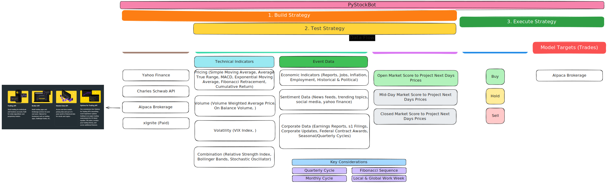

# PyStockBot

PyStockBot is a comprehensive machine learning-powered stock prediction and analysis platform that combines advanced Python data processing with a modern web dashboard interface.

**DISCLAIMER:** *In general, there is no preference given to any of these metrics, models, and resources, this is not a recommendation to use them. Besides implementing and categorizing them Uhstray.io and all contributors are not officially suggesting any opinion on any of these, Uhstray.io and any contributors are not financial advisors. Do your own due diligence and speak to a professional financial advisor before making any financial decisions.*

## 🏗️ Architecture Overview

PyStockBot consists of two main components:

### 1. Python ML Pipeline (`stonks/` & `crypto/`)
- **Data Collection**: Automated fetching from Yahoo Finance, market events, and corporate actions
- **Feature Engineering**: 200+ technical indicators including moving averages, RSI, MACD, Bollinger Bands, ADX, Fibonacci retracements, and Hurst exponent
- **Machine Learning**: XGBoost and other models for price prediction and market analysis
- **Multi-Asset Support**: Stocks, cryptocurrencies, ETFs, and indices

### 2. Next.js Dashboard (`ui/`)
- **Modern UI**: React 19 + Next.js 15 with TypeScript
- **Professional Design**: Financial-focused interface with dark/light themes
- **Interactive Charts**: Real-time visualizations using Recharts
- **Multiple Dashboards**: ML predictions, market indicators, social sentiment, earnings analysis, and asset tracking
- **Responsive Design**: Optimized for desktop and mobile viewing

## Trading Design Architecture



## 🚀 Quick Start

### Prerequisites
- Python 3.13+
- Node.js 18+
- pnpm (for UI development)

### Python Environment Setup

This project uses `uv` as the Python package manager for faster dependency resolution:

```bash
# Install uv
pip install -U uv

# Install Python dependencies
uv sync
```

### UI Development Setup

```bash
# Navigate to UI directory
cd ui

# Install dependencies
pnpm install

# Start development server
pnpm dev

# Build for production
pnpm build

# Run linting
pnpm lint
```

## 📊 ML Pipeline Execution

Run the Jupyter notebooks in sequence to execute the complete ML pipeline:

### Core Pipeline
1. **`pull_data.ipynb`** - Fetch OHLCV market data from Yahoo Finance
2. **`pull_events.ipynb`** - Collect market events and news sentiment
3. **`pull_dividends_splits.ipynb`** - Gather dividend and stock split data
4. **`prepare_dataset.ipynb`** - Advanced feature engineering with technical indicators
5. **`train_model.ipynb`** - Train ML models (XGBoost, neural networks)
6. **`analyze_model.ipynb`** - Model evaluation and performance analysis

### Additional Notebooks
- **`adx_rsi_trendlines.ipynb`** - Specialized ADX and RSI analysis
- **`valid_trendlines.ipynb`** - Trendline validation and pattern recognition

## 🎯 Key Features

### Machine Learning Capabilities
- **Advanced Technical Indicators**: RSI, MACD, Bollinger Bands, ADX, Stochastic Oscillator
- **Pattern Recognition**: Fibonacci retracements, trendline analysis, support/resistance levels
- **Multi-Timeframe Analysis**: 7, 14, and 30-day analysis windows
- **Event-Driven Features**: Market events with decay factors for temporal relevance
- **Ensemble Models**: XGBoost, Random Forest, and neural network architectures

### Dashboard Features
- **ML Indicator Dashboard**: AI-powered trading signals and model confidence metrics
- **Market Analysis**: Real-time technical indicator visualization
- **Social Sentiment**: News and social media sentiment analysis
- **Earnings Tracker**: Corporate earnings analysis and predictions
- **Asset Portfolio**: Multi-asset tracking and performance monitoring
- **Risk Management**: Volatility analysis and risk factor assessment

### Data Processing
- **Automated Data Pipeline**: Scheduled data collection and processing
- **Feature Engineering**: 200+ engineered features per asset
- **Data Validation**: Comprehensive data quality checks and error handling
- **Efficient Storage**: Parquet format for optimized data storage and retrieval

## 🛠️ Technology Stack

### Backend (Python)
- **Data Processing**: pandas, numpy, yfinance
- **Machine Learning**: scikit-learn, XGBoost, Keras
- **Visualization**: matplotlib, seaborn, plotly
- **Technical Analysis**: Custom implementations of financial indicators
- **Package Management**: uv for fast dependency resolution

### Frontend (Next.js)
- **Framework**: Next.js 15 with React 19
- **Styling**: Tailwind CSS with custom financial theme
- **Components**: shadcn/ui with Radix UI primitives
- **Charts**: Recharts for interactive financial visualizations
- **Typography**: Professional financial fonts (Source Sans Pro, Playfair Display)
- **State Management**: React hooks and context

## 📁 Project Structure

```
PyStockBot/
├── stonks/src/           # Stock analysis notebooks
├── crypto/src/           # Cryptocurrency analysis notebooks
├── ui/                   # Next.js web dashboard
│   ├── app/             # Next.js app router
│   ├── components/      # React components
│   └── styles/          # CSS and styling
├── CLAUDE.md            # Development guidelines
└── cleannb.py          # Notebook cleaning utility
```

## Contributing Guidelines

We welcome contributions to PyStockBot! Please read our guidelines:

- [Review our Code of Conduct](https://www.uhstray.io/en/code-of-conduct)
- [Check our CONTRIBUTING.MD](./CONTRIBUTING.md)

### Development Workflow
1. Fork the repository
2. Create a feature branch
3. Make your changes following our coding standards
4. Test thoroughly (both Python and UI components)
5. Submit a pull request with detailed description

## Resources

### Articles
https://machinelearningmastery.com/xgboost-for-time-series-forecasting/
https://www.kaggle.com/code/faressayah/stock-market-analysis-prediction-using-lstm/notebook

### Videos
https://www.youtube.com/watch?v=vV12dGe_Fho
https://www.youtube.com/watch?v=z3ZnOW-S550

### Libraries
https://scikit-learn.org/stable/modules/generated/sklearn.model_selection.TimeSeriesSplit.html
https://pandas-datareader.readthedocs.io/en/latest/remote_data.html
