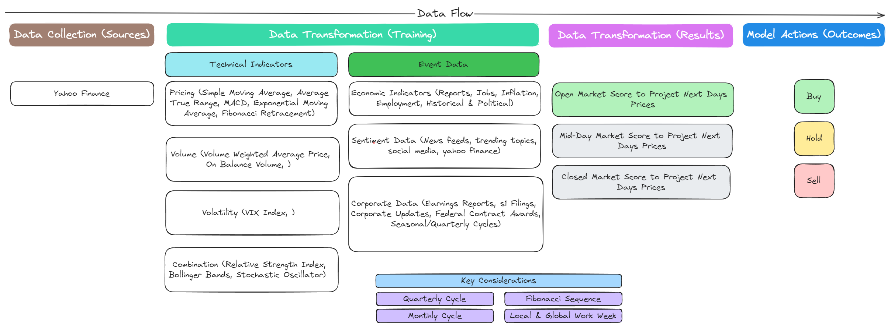

# PyStockBot
This is a project to create a stock bot that can predict the stock price of a company using machine learning.

**DISCLAIMER:** *In general, there is no preference given to any of these metrics, models, and resources, this is not a recommendation to use them. Besides implementing and categorizing them Uhstray.io and all contributors are not officially suggesting any opinion on any of these, Uhstray.io and any contributors are not financial advisors. Do your own due diligence and speak to a professional financial advisor before making any financial decisions.*

## Trading Design Architecture



## Installation
```bash
pip install scikit-learn pandas numpy matplotlib xgboost yfinance seaborn autopep8 pandas-datareader keras tensorflow ipykernel pyarrow graphviz
```


## Running the code
Run the notebooks in the following order:
1. pull_data.ipynb
1. pull_events.ipynb
2. pull_dividends_splits.ipynb
3. prepare_dataset.ipynb
4. train_model.ipynb
5. analyze_model.ipynb

## Understanding the code
The code is divided into the following sections:

## Understanding the data

## Understanding the metrics


## Resources

### Data

### Articles
https://machinelearningmastery.com/xgboost-for-time-series-forecasting/
https://www.kaggle.com/code/faressayah/stock-market-analysis-prediction-using-lstm/notebook


### Videos
https://www.youtube.com/watch?v=vV12dGe_Fho
https://www.youtube.com/watch?v=z3ZnOW-S550

### Libraries
https://scikit-learn.org/stable/modules/generated/sklearn.model_selection.TimeSeriesSplit.html
https://pandas-datareader.readthedocs.io/en/latest/remote_data.html
